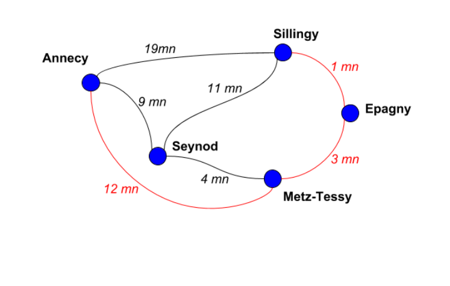
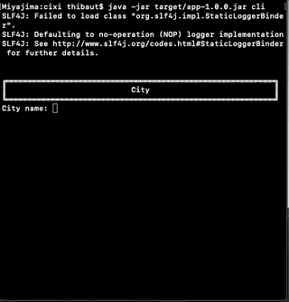
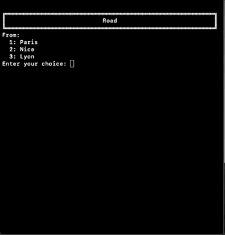
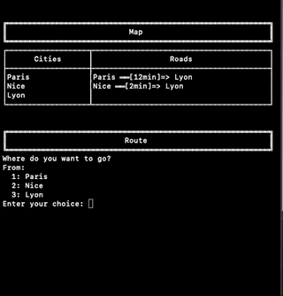

# CIXI Kata
Kotlin Version in `kotlin` branch

## Challenge



We ask you to develop a window program which builds the map according to user input and then generates the shortest track between two existing cities selected by the user. The map is made of two types of objects :
- Cities​ : A city is defined by its unique name
- Roads : A road links two existing cities, and has a given length. Note that the length is a time

metrics in the example above, but we could also have used the distance between the two cities.
When launching the program, the user gets a window interface in which he can create cities, add roads and ask for the shortest path between two created cities. Feel free to implement this interface using any kind of widget (such as text zones, buttons, lists...). As an option, you can push the UI further by drawing cities and roads, or by adding some other visual features improving the user experience.

## Requirement

* Java 11 

## Build 

To build the project execute in the root directory: 

```bash
./mvnw clean install
```

## Simulator

```bash
java -jar target/app-1.0.0.jar
```

Output:

```bash
  ╔══════════════════════════════════════════════════════════╗
  ║                           City                           ║
  ╚══════════════════════════════════════════════════════════╝
                                                   Sillingy ✓ 
                                                     Annecy ✓ 
                                                     Epagny ✓ 
                                                 Metz-Tessy ✓ 
                                                     Seynod ✓ 
  
  
  ╔══════════════════════════════════════════════════════════╗
  ║                           Road                           ║
  ╚══════════════════════════════════════════════════════════╝
                                 Sillingy ══[1min]=> Epagny ✓ 
                               Epagny ══[3min]=> Metz-Tessy ✓ 
                              Metz-Tessy ══[12min]=> Annecy ✓ 
                               Metz-Tessy ══[4min]=> Seynod ✓ 
                                Sillingy ══[11min]=> Seynod ✓ 
                                Sillingy ══[19min]=> Annecy ✓ 
                                   Annecy ══[9min]=> Seynod ✓ 
  
  
  ╔══════════════════════════════════════════════════════════╗
  ║                           Map                            ║
  ╚══════════════════════════════════════════════════════════╝
  ┌──────────────────┬───────────────────────────────────────┐
  │      Cities      │                 Roads                 │
  ├──────────────────┼───────────────────────────────────────┤
  │Sillingy          │Sillingy ══[1min]=> Epagny             │
  │Annecy            │Epagny ══[3min]=> Metz-Tessy           │
  │Epagny            │Metz-Tessy ══[12min]=> Annecy          │
  │Metz-Tessy        │Metz-Tessy ══[4min]=> Seynod           │
  │Seynod            │Sillingy ══[11min]=> Seynod            │
  │                  │Sillingy ══[19min]=> Annecy            │
  │                  │Annecy ══[9min]=> Seynod               │
  └──────────────────┴───────────────────────────────────────┘
  
  
  ╔══════════════════════════════════════════════════════════╗
  ║                          Route                           ║
  ╚══════════════════════════════════════════════════════════╝
  ╔══════════════════════════════════════════════════════════╗
  ║                   Sillingy ==> Annecy                    ║
  ╠═════════════════════════════╦════════════════════════════╣
  ║       Arrived: 14:35        ║      Duration: 16 min      ║
  ╠═════════════════════════════╩════════════════════════════╣
  ║1. Sillingy ══[1min]=> Epagny                             ║
  ║2. Epagny ══[3min]=> Metz-Tessy                           ║
  ║3. Metz-Tessy ══[12min]=> Annecy                          ║
  ╚══════════════════════════════════════════════════════════╝
```

## Command-Line Interface 

```bash
java -jar target/app-1.0.0.jar cli
```







## Architecture

Hexagonal Architecture,  more information [here](https://blog.octo.com/architecture-hexagonale-trois-principes-et-un-exemple-dimplementation/)

## External Library

- `junit` & `assertJ` & `mockito` for testing, because testing is life ;)
- [`hipster`](https://github.com/citiususc/hipster) for shortest path algorithm using **Dijkstra's algorithm**. Easy to use, perfectly adapted to my need, fully tested and 237 stars on Github.
- `text-io` & `asciitable` for display. Fully tested and easy to use.
